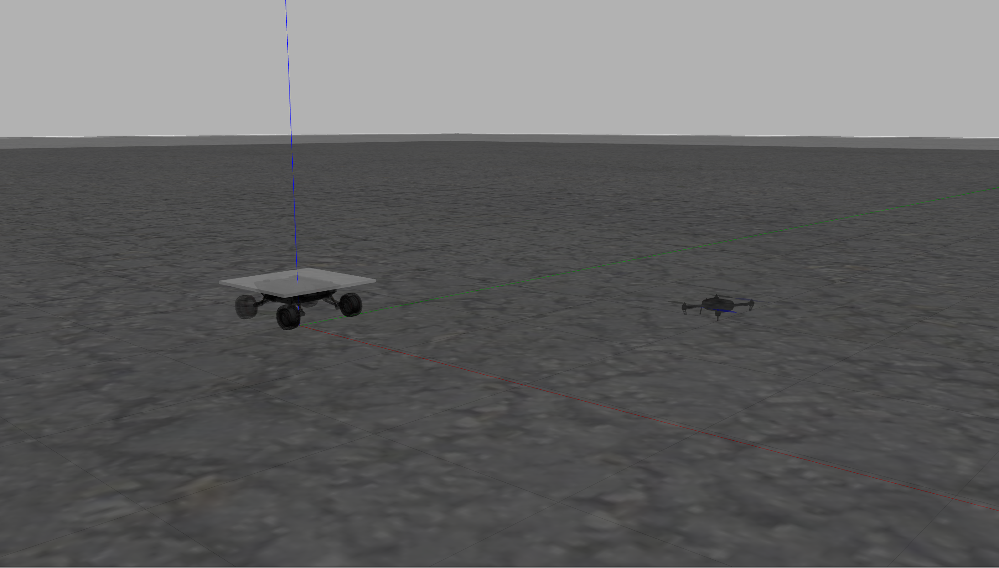

# ALAN Gazebo Simulation


## 1.	Introduction of Function Package
This repo is based upon [AgileX Gazebo Simulation Package](https://github.com/agilexrobotics/ugv_gazebo_sim), which was intentionally modified for project [ALAN](https://github.com/pattylo/alan), a framework for autonomous dynamic landing utilizing a non-robocentric approach. </br>

! Current version does not include LED Marker Detection, which would soon be added

## 2.	Pre-requisite

### Development Environment

​   We tested it on ubuntu 20.04 + [ROS Noetic desktop full](http://wiki.ros.org/noetic/Installation/Ubuntu)

### Download and install required function package

​	Download and install ros-control function package, ros-control is the robot control middleware provided by ROS

```
sudo apt-get install ros-noetic-ros-control
```

​	Download and install ros-controllers function package, ros-controllers are the kinematics plug-in of common models provided by ROS

```
sudo apt-get install ros-noetic-ros-controllers
```

​	Download and install gazebo-ros function package, gazebo-ros is the communication interface between gazebo and ROS, and connect the ROS and Gazebo

```
sudo apt-get install ros-noetic-gazebo-ros
```

​	Download and install gazebo-ros-control function package, gazebo-ros-control is the communication standard controller between ROS and Gazebo

```
sudo apt-get install ros-noetic-gazebo-ros-control
```

​	Download and install joint-state-publisher-gui package.This package is used to visualize the joint control.

```
sudo apt-get install ros-noetic-joint-state-publisher-gui 
```

​	Download and install teleop-twist-keyboard function package, telop-twist-keyboard is keyboard control function package, the robot can be controlled to move forward, left, right and backward through "i", "j", "l",and "," on the keyboard

```
sudo apt-get install ros-noetic-teleop-twist-keyboard 
```


## 3.	About Usage

### Create workspace, download simulation model function package and compile

​		Open a new terminal and create a workspace named alang_ws, enter in the terminal:

```
mkdir alang_ws
```

​		Enter the alang_ws folder

```
cd alang_ws
```

​		Create a folder to store function package named src

```
mkdir src
```

​		Enter the src folder

```
cd src
```

​		Initialize folder

```
catkin_init_workspace
```

​		Download simulation model function package

```
git clone https://github.com/HKPolyU-UAV/alan_sim.git
```

​		Enter the alang_ws folder

```
cd alang_ws
```

​		Confirm whether the dependency of the function package is installed
```
rosdep install --from-paths src --ignore-src -r -y 
```

​		Compile

```
catkin_make
```


### Run it!

​	Enter the alang_ws folder

```
cd alang_ws/src/alan_sim
```

​	Run sim.sh

```
./sim.sh
```

​	Start the simulation environment of one UGV and one UAV, as shown below.
</br>

 